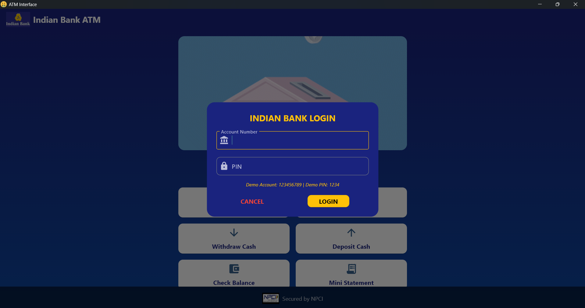
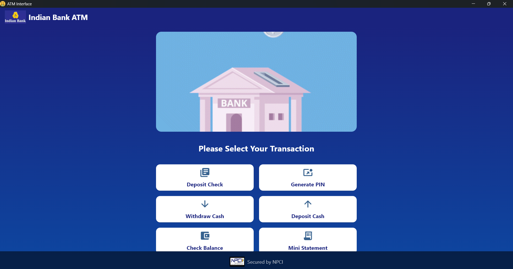
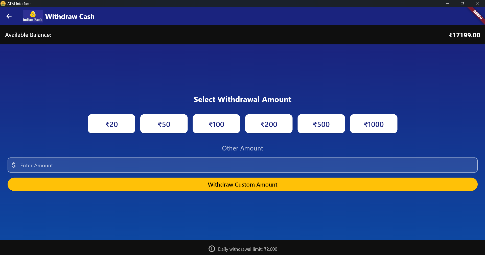
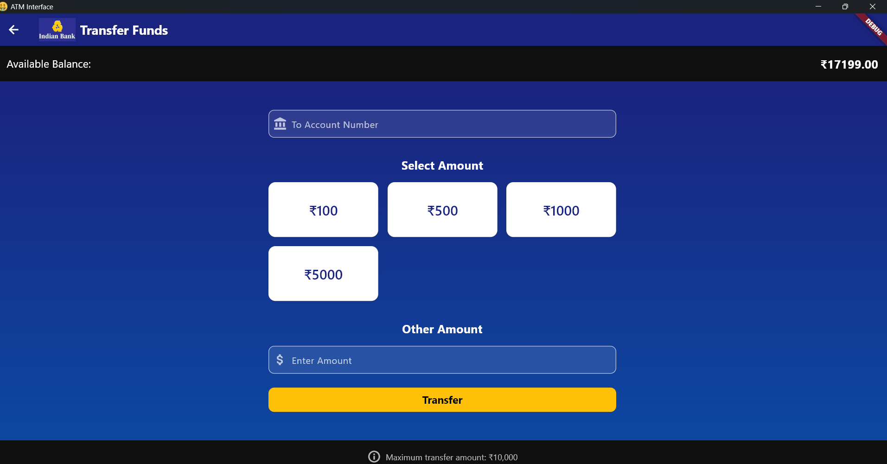
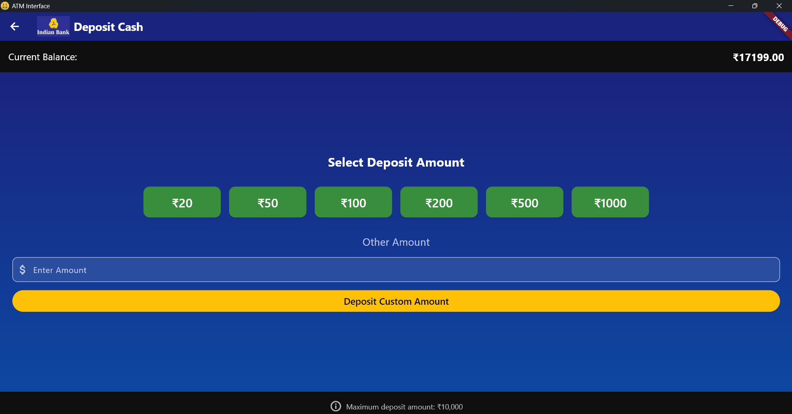
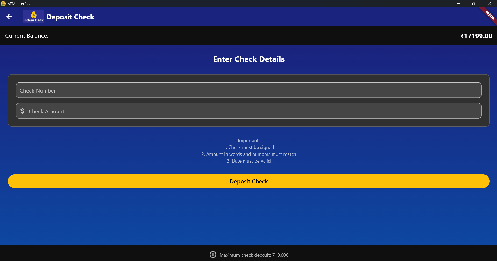
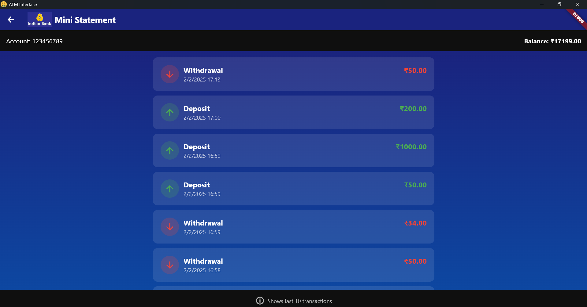

# Indian Bank ATM Interface

A modern and secure ATM interface built with Flutter, featuring a sleek design and comprehensive banking functionality.


## 🌟 Features

- 🔒 Secure PIN-based authentication
- 💰 Check account balance
- 💳 Cash withdrawals with fixed amount options
- 💵 Cash deposits with multiple denomination support
- 📝 Check deposits with validation
- 📱 Fund transfers between accounts
- 📊 Transaction history and mini statements
- 🔐 PIN generation and management
- 🎨 Modern UI with smooth animations
- 🌙 Professional color scheme with dark mode

## 🚀 Technologies Used

- **Framework**: Flutter
- **State Management**: Provider
- **Architecture**: MVVM Pattern
- **Storage**: In-memory (demo purposes)
- **UI Components**: Material Design
- **Animations**: Flutter built-in animations

## 📱 Screenshots

<table>
  <tr>
    <td>Login Screen</td>
    <td>Dashboard</td>
    <td>Withdraw Cash</td>
        <td>Money Transfer</td>

  </tr>
  <tr>
    <td></td>
    <td></td>
        <td></td>
            <td></td>


  </tr>
  <tr>
    <td>Deposit Cash</td>
    <td>Check Deposit</td>
    <td>Transaction History</td>
  </tr>
  <tr>
    <td></td>
    <td></td>
    <td></td>
  </tr>
</table>

## 🛠 Installation

1. **Prerequisites**
   ```bash
   flutter --version  # Ensure Flutter is installed
   ```

2. **Clone the Repository**
   ```bash
   git clone https://github.com/anandssm/atminterface.git
   cd atminterface
   ```

3. **Install Dependencies**
   ```bash
   flutter pub get
   ```

4. **Run the App**
   ```bash
   flutter run
   ```

## 💻 Usage

### Demo Account
- **Account Number**: 123456789
- **PIN**: 1234

### Available Operations

1. **Login**
   - Enter account number and PIN
   - Use demo credentials for testing

2. **Withdraw Cash**
   - Choose from preset amounts (₹20 to ₹1000)
   - Enter custom amount
   - Daily limit: ₹2,000

3. **Deposit Money**
   - Cash deposits with fixed denominations
   - Check deposits with validation
   - Maximum limit: ₹10,000

4. **Account Management**
   - View balance
   - Generate new PIN
   - Change existing PIN
   - View transaction history

5. **Fund Transfers**
   - Transfer to other accounts
   - Instant confirmation
   - Transaction history update

## 📁 Project Structure

```
lib/
├── main.dart
├── models/
│   ├── account.dart
│   └── transaction.dart
├── providers/
│   └── atm_provider.dart
└── screens/
    ├── dashboard_screen.dart
    ├── deposit_screen.dart
    ├── deposit_check_screen.dart
    ├── withdraw_screen.dart
    ├── transfer_screen.dart
    ├── transaction_history_screen.dart
    ├── generate_pin_screen.dart
    ├── change_pin_screen.dart
    └── login_screen.dart
```

## 🛡️ Security Features

- PIN encryption for secure authentication
- Session management
- Transaction limits
- Automatic session timeout
- Input validation and sanitization

## 🎯 Future Enhancements

- [ ] Biometric authentication
- [ ] QR code-based transfers
- [ ] Multi-language support
- [ ] Push notifications
- [ ] Transaction receipt generation
- [ ] Card-less withdrawals

## 🤝 Contributing

Contributions are welcome! Please feel free to submit a Pull Request.

## 📄 License

This project is licensed under the MIT License - see the [LICENSE](LICENSE) file for details.

## 🙏 Acknowledgments

- Indian Bank for design inspiration
- NPCI for security guidelines
- Flutter community for excellent packages

---

<p align="center">
  Made with ❤️ for a better banking experience
</p>
